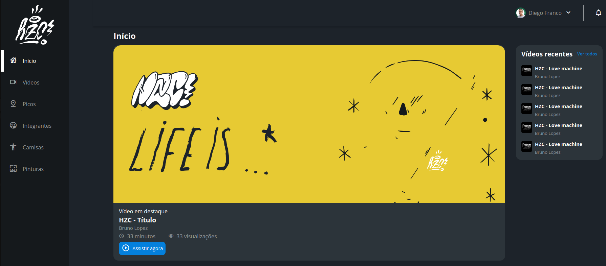

# HZC Flex box e Grid Container

 

Este projeto implemeta as ferramentas de Flex box e Grid Container do CSS em uma pagina HTML.

Este projeto ainda não possui interatividade com o usuario, porém irei implentar estas funcionalidades na proxima versão deste projeto, onde usarei React.

 

## Interface do projeto

  

## Sumário

- [Tecnologias Utilizadas](#tecnologias-utilizadas)
- [Status](#status)
- [Descrição](#descrição)
- [Funcionalidades](#funcionalidades)
- [Como Usar](#como-usar)
- [Estrutura do Projeto](#estrutura-do-projeto)
- [Autor](#autor)

## Tecnologias Utilizadas

  

    
  

  

    
  

  

    
  

## Status

## Descrição

Basicamente é um site de videos, onde o usuario pode acessar e visulizar os seus videos favoritos.

## Funcionalidades

Site responsivo e estilizado.

## Como Usar

1. git clone "nomeDoReprositorio".
2. Abrir projeto em sua IDE.
3. Utilizar o liveServer no arquivo HTML.

## Estrutura do Projeto

- assets
- index.html
- index.js

## Autor

Desenvolvido por Diego Franco.
